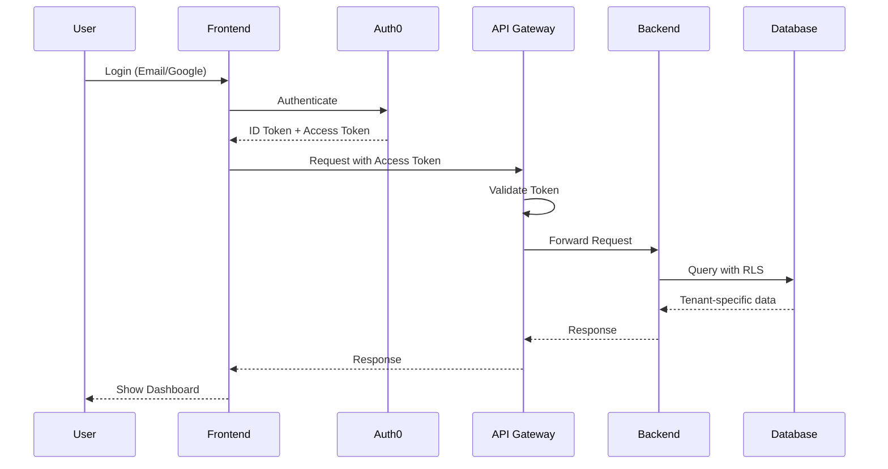

# Secure Authentication Architecture

## 1. Authentication Flow (Recommended)

### A. Frontend → Auth0 → Backend Pattern



### B. Key Security Principles

1. **Never expose backend URLs to frontend**
2. **All backend calls go through API Gateway**
3. **Frontend only knows about Auth0 and API Gateway**
4. **Tenant ID never exposed in URLs**

## 2. Secure Implementation

### A. Environment Variables

```bash
# Frontend (.env.local)
NEXT_PUBLIC_AUTH0_DOMAIN=auth.dottapps.com
NEXT_PUBLIC_AUTH0_CLIENT_ID=your-client-id
NEXT_PUBLIC_API_GATEWAY_URL=https://api.dottapps.com

# Backend (.env)
AUTH0_DOMAIN=auth.dottapps.com
AUTH0_API_IDENTIFIER=https://api.dottapps.com
DATABASE_URL=postgresql://...
```

### B. API Gateway Configuration

```javascript
// api-gateway.js
const express = require('express');
const { auth } = require('express-oauth2-jwt-bearer');

const app = express();

// Auth0 middleware
const checkJwt = auth({
  audience: process.env.AUTH0_API_IDENTIFIER,
  issuerBaseURL: `https://${process.env.AUTH0_DOMAIN}/`,
  tokenSigningAlg: 'RS256'
});

// Apply to all routes
app.use(checkJwt);

// Extract tenant from JWT
app.use((req, res, next) => {
  const tenantId = req.auth.payload['https://dottapps.com/tenant_id'];
  req.tenantId = tenantId;
  next();
});

// Proxy to backend with tenant context
app.all('/api/*', (req, res) => {
  const backendUrl = process.env.BACKEND_URL;
  // Forward request with tenant context in headers
  proxyRequest(req, res, backendUrl, {
    headers: {
      'X-Tenant-ID': req.tenantId,
      'X-User-ID': req.auth.payload.sub
    }
  });
});
```

### C. Frontend API Service

```javascript
// services/api.js
class SecureAPIService {
  constructor() {
    this.baseURL = process.env.NEXT_PUBLIC_API_GATEWAY_URL;
  }

  async request(endpoint, options = {}) {
    const token = await this.getAccessToken();
    
    const response = await fetch(`${this.baseURL}${endpoint}`, {
      ...options,
      headers: {
        ...options.headers,
        'Authorization': `Bearer ${token}`,
        'Content-Type': 'application/json'
      }
    });

    if (!response.ok) {
      throw new Error(`API Error: ${response.status}`);
    }

    return response.json();
  }

  async getAccessToken() {
    // Get token from Auth0
    const { getAccessTokenSilently } = useAuth0();
    return await getAccessTokenSilently();
  }
}

export const api = new SecureAPIService();
```

### D. Backend Middleware

```python
# middleware/auth.py
from functools import wraps
from flask import request, g
import jwt
from jwt import PyJWKClient

class Auth0Middleware:
    def __init__(self, domain, api_identifier):
        self.domain = domain
        self.api_identifier = api_identifier
        self.jwks_client = PyJWKClient(f"https://{domain}/.well-known/jwks.json")

    def requires_auth(self, f):
        @wraps(f)
        def decorated(*args, **kwargs):
            token = self.get_token_from_header()
            payload = self.verify_token(token)
            
            # Set tenant context
            g.tenant_id = payload.get('https://dottapps.com/tenant_id')
            g.user_id = payload.get('sub')
            
            return f(*args, **kwargs)
        return decorated

    def verify_token(self, token):
        signing_key = self.jwks_client.get_signing_key_from_jwt(token)
        
        payload = jwt.decode(
            token,
            signing_key.key,
            algorithms=["RS256"],
            audience=self.api_identifier,
            issuer=f"https://{self.domain}/"
        )
        
        return payload
```

## 3. Secure URL Structure

### Instead of exposing tenant IDs:

```javascript
// ❌ BAD: Exposes tenant structure
/tenant/81b1a2d0-3c71-462a-9bf6-2ecab0f61c8d/dashboard

// ✅ GOOD: No tenant exposure
/dashboard
/settings
/reports
```

### Backend handles tenant context from JWT:

```python
@app.route('/api/dashboard')
@auth.requires_auth
def get_dashboard():
    tenant_id = g.tenant_id  # From JWT
    # Query with tenant context
    data = db.query(
        "SELECT * FROM metrics WHERE tenant_id = %s",
        [tenant_id]
    )
    return jsonify(data)
```

## 4. Secure Onboarding Flow

### A. Auth0 Rules/Actions

```javascript
// Auth0 Action: Post-Login
exports.onExecutePostLogin = async (event, api) => {
  const namespace = 'https://dottapps.com/';
  
  // Check if user has tenant
  if (!event.user.app_metadata.tenant_id) {
    // New user - create tenant
    const tenantId = uuid.v4();
    
    // Call management API to update user
    await management.updateUser(event.user.user_id, {
      app_metadata: {
        tenant_id: tenantId,
        onboarding_complete: false
      }
    });
    
    // Add to token
    api.idToken.setCustomClaim(`${namespace}tenant_id`, tenantId);
    api.idToken.setCustomClaim(`${namespace}needs_onboarding`, true);
    api.accessToken.setCustomClaim(`${namespace}tenant_id`, tenantId);
  } else {
    // Existing user
    api.idToken.setCustomClaim(
      `${namespace}tenant_id`, 
      event.user.app_metadata.tenant_id
    );
    api.accessToken.setCustomClaim(
      `${namespace}tenant_id`, 
      event.user.app_metadata.tenant_id
    );
  }
};
```

### B. Frontend Onboarding Check

```javascript
// components/ProtectedRoute.js
import { useAuth0 } from '@auth0/nextjs-auth0/client';
import { useRouter } from 'next/navigation';

export function ProtectedRoute({ children }) {
  const { user, isLoading } = useAuth0();
  const router = useRouter();

  useEffect(() => {
    if (!isLoading && user) {
      const needsOnboarding = user['https://dottapps.com/needs_onboarding'];
      
      if (needsOnboarding && !router.pathname.startsWith('/onboarding')) {
        router.push('/onboarding');
      }
    }
  }, [user, isLoading, router]);

  if (isLoading) return <Loading />;
  if (!user) return <Redirect to="/login" />;
  
  return children;
}
```

## 5. Secure Account Closure

### A. Frontend Request

```javascript
// services/account.js
export async function closeAccount(reason, feedback) {
  try {
    const response = await api.request('/api/account/close', {
      method: 'POST',
      body: JSON.stringify({ reason, feedback })
    });
    
    // Clear local data
    await clearLocalStorage();
    await clearIndexedDB();
    
    // Logout from Auth0
    window.location.href = '/api/auth/logout?returnTo=/goodbye';
    
  } catch (error) {
    console.error('Account closure failed:', error);
    throw error;
  }
}
```

### B. Backend Processing

```python
@app.route('/api/account/close', methods=['POST'])
@auth.requires_auth
def close_account():
    user_id = g.user_id
    tenant_id = g.tenant_id
    
    with db.transaction():
        # Create audit log
        db.execute("""
            INSERT INTO account_closures 
            (user_id, tenant_id, reason, feedback, closed_at)
            VALUES (%s, %s, %s, %s, NOW())
        """, [user_id, tenant_id, reason, feedback])
        
        # Anonymize user data (GDPR compliant)
        db.execute("""
            UPDATE users 
            SET email = CONCAT('deleted_', id, '@deleted.com'),
                name = 'Deleted User',
                is_active = FALSE,
                deleted_at = NOW()
            WHERE id = %s
        """, [user_id])
        
        # Schedule Auth0 deletion (after grace period)
        tasks.schedule_auth0_deletion(user_id, days=30)
    
    return jsonify({'success': True})
```

## 6. Security Best Practices

### A. Token Management

```javascript
// utils/auth.js
export class TokenManager {
  constructor() {
    this.accessToken = null;
    this.tokenExpiry = null;
  }

  async getToken() {
    // Check if token is still valid
    if (this.accessToken && this.tokenExpiry > Date.now()) {
      return this.accessToken;
    }

    // Get new token
    const { getAccessTokenSilently } = useAuth0();
    this.accessToken = await getAccessTokenSilently({
      audience: process.env.NEXT_PUBLIC_AUTH0_AUDIENCE,
      scope: 'read:dashboard write:settings'
    });

    // Decode to get expiry
    const decoded = jwt_decode(this.accessToken);
    this.tokenExpiry = decoded.exp * 1000;

    return this.accessToken;
  }

  clearToken() {
    this.accessToken = null;
    this.tokenExpiry = null;
  }
}
```

### B. Content Security Policy

```javascript
// next.config.js
module.exports = {
  async headers() {
    return [
      {
        source: '/:path*',
        headers: [
          {
            key: 'Content-Security-Policy',
            value: [
              "default-src 'self'",
              "script-src 'self' 'unsafe-eval' 'unsafe-inline' https://*.auth0.com",
              "style-src 'self' 'unsafe-inline'",
              "img-src 'self' data: https:",
              "font-src 'self'",
              "connect-src 'self' https://*.auth0.com https://api.dottapps.com",
              "frame-ancestors 'none'",
              "form-action 'self'"
            ].join('; ')
          },
          {
            key: 'X-Frame-Options',
            value: 'DENY'
          },
          {
            key: 'X-Content-Type-Options',
            value: 'nosniff'
          },
          {
            key: 'Referrer-Policy',
            value: 'strict-origin-when-cross-origin'
          }
        ]
      }
    ];
  }
};
```

### C. Rate Limiting

```javascript
// middleware/rateLimiter.js
const rateLimit = require('express-rate-limit');

exports.authLimiter = rateLimit({
  windowMs: 15 * 60 * 1000, // 15 minutes
  max: 5, // 5 requests per window
  message: 'Too many login attempts, please try again later',
  standardHeaders: true,
  legacyHeaders: false,
});

exports.apiLimiter = rateLimit({
  windowMs: 1 * 60 * 1000, // 1 minute
  max: 100, // 100 requests per minute
  message: 'Too many requests, please try again later',
  standardHeaders: true,
  legacyHeaders: false,
});
```

## 7. Monitoring and Logging

### A. Authentication Events

```javascript
// services/monitoring.js
export function logAuthEvent(event, metadata) {
  const payload = {
    event,
    timestamp: new Date().toISOString(),
    user_id: metadata.userId,
    ip_address: metadata.ipAddress,
    user_agent: metadata.userAgent,
    ...metadata
  };

  // Send to logging service
  fetch('/api/logs/auth', {
    method: 'POST',
    headers: { 'Content-Type': 'application/json' },
    body: JSON.stringify(payload)
  });
}

// Usage
logAuthEvent('login_success', {
  userId: user.sub,
  method: 'google_oauth',
  ipAddress: req.ip,
  userAgent: req.headers['user-agent']
});
```

### B. Anomaly Detection

```python
# services/security.py
class AnomalyDetector:
    def check_login_anomalies(self, user_id, ip_address, user_agent):
        # Check for suspicious patterns
        recent_logins = self.get_recent_logins(user_id)
        
        # Different country in short time
        if self.is_impossible_travel(recent_logins, ip_address):
            self.flag_suspicious_activity(user_id, 'impossible_travel')
            return False
        
        # Too many different IPs
        if self.too_many_ips(recent_logins):
            self.flag_suspicious_activity(user_id, 'multiple_ips')
            return False
        
        # New device
        if self.is_new_device(user_id, user_agent):
            self.send_new_device_notification(user_id)
        
        return True
```

## 8. Testing Security

### A. Security Test Suite

```javascript
// tests/security.test.js
describe('Authentication Security', () => {
  test('should not expose tenant ID in responses', async () => {
    const response = await api.get('/api/user/profile');
    expect(response.body).not.toHaveProperty('tenant_id');
    expect(response.body).not.toHaveProperty('tenantId');
  });

  test('should reject requests without valid token', async () => {
    const response = await fetch('/api/dashboard', {
      headers: { 'Authorization': 'Bearer invalid-token' }
    });
    expect(response.status).toBe(401);
  });

  test('should prevent cross-tenant access', async () => {
    const user1Token = await getTokenForUser('user1@test.com');
    const user2Data = await getDataForUser('user2@test.com');
    
    const response = await fetch(`/api/data/${user2Data.id}`, {
      headers: { 'Authorization': `Bearer ${user1Token}` }
    });
    
    expect(response.status).toBe(403);
  });
});
```

### B. Penetration Testing Checklist

- [ ] SQL Injection attempts
- [ ] JWT token manipulation
- [ ] Cross-tenant data access
- [ ] Rate limiting bypass
- [ ] CSRF attacks
- [ ] XSS attempts
- [ ] Session fixation
- [ ] Password brute force
- [ ] API enumeration
- [ ] Information disclosure

## Summary

This architecture provides:
1. **Complete separation** between frontend and backend
2. **No direct backend exposure** to the internet
3. **Tenant isolation** at multiple levels
4. **Audit trails** for all sensitive operations
5. **GDPR compliance** for data deletion
6. **Security monitoring** and anomaly detection
7. **Rate limiting** to prevent abuse
8. **Proper CSP headers** to prevent XSS

This is the production-ready, secure approach used by enterprise SaaS applications.