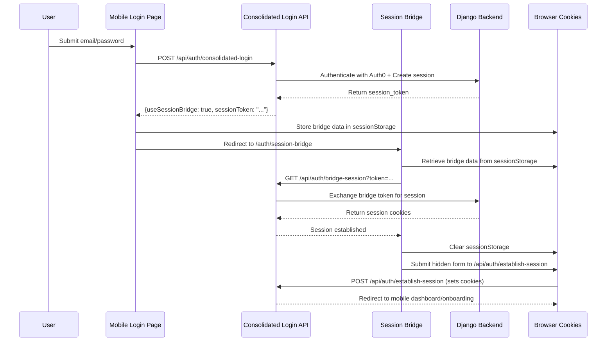

# Mobile Session Bridge Architecture

*Last Updated: 2025-07-12*

## Overview

The Mobile Session Bridge is a secure authentication mechanism that ensures proper session establishment for mobile users after login. It addresses the challenge of setting browser cookies from API responses in mobile authentication flows.

## Problem Statement

**Traditional web login** uses forms and redirects that naturally set cookies:
- User submits form → Server processes → Sets cookies → Redirects with cookies

**Modern SPA/Mobile login** uses fetch/AJAX which doesn't automatically handle cookies:
- User submits JSON → API responds with token → Need to manually set cookies

The Mobile Session Bridge solves this by bridging the gap between API authentication and browser session establishment.

## Architecture Flow



## Components

### 1. Mobile Login Page (`/src/app/auth/mobile-login/page.js`)

**Responsibility**: Detect session bridge requirement and initiate bridge flow

```javascript
// After successful authentication
if (data.useSessionBridge && data.sessionToken) {
  // Store bridge data with expiration
  const bridgeData = {
    token: data.sessionToken,
    redirectUrl: data.onboardingCompleted ? '/mobile' : '/onboarding',
    timestamp: Date.now()
  };
  
  sessionStorage.setItem('session_bridge', JSON.stringify(bridgeData));
  router.push('/auth/session-bridge');
}
```

### 2. Consolidated Login API (`/src/app/api/auth/consolidated-login/route.js`)

**Responsibility**: Authenticate user and determine if session bridge is needed

```javascript
// After successful backend authentication
const response = NextResponse.json({
  success: true,
  ...authData,          // Auth0 tokens
  ...sessionData,       // Session and user data
  useSessionBridge: true,     // Flag to use bridge
  sessionToken: sessionData.session_token
});
```

### 3. Session Bridge Page (`/src/app/auth/session-bridge/page.js`)

**Responsibility**: Exchange bridge token for actual session and redirect

Key steps:
1. Retrieve bridge data from sessionStorage
2. Validate data age (< 30 seconds)
3. Exchange bridge token via `/api/auth/bridge-session`
4. Submit hidden form to `/api/auth/establish-session`
5. Clean up and redirect to intended destination

### 4. Bridge Session API (`/src/app/api/auth/bridge-session/route.js`)

**Responsibility**: Exchange bridge token for session validation

```javascript
// Validates bridge token with backend
const response = await fetch(`${API_URL}/api/sessions/validate-bridge/`, {
  method: 'POST',
  body: JSON.stringify({ bridge_token: token })
});
```

### 5. Establish Session API (`/src/app/api/auth/establish-session/route.js`)

**Responsibility**: Set final session cookies via form POST

This endpoint receives form data and sets the actual session cookies that the browser will use for subsequent requests.

## Security Features

### 1. Time-based Expiration
- Bridge data expires after 30 seconds
- Prevents replay attacks and token leakage

### 2. Single-use Tokens
- Bridge tokens are consumed on first use
- Cannot be reused for multiple sessions

### 3. SessionStorage Isolation
- Bridge data stored in sessionStorage (tab-specific)
- Automatically cleared on tab close
- Not accessible across different origins

### 4. Automatic Cleanup
- SessionStorage cleared after successful bridge
- Failed bridges also clean up data
- Prevents accumulation of sensitive data

## Configuration

### Public Routes

Ensure these routes are public in `/src/lib/authUtils.js`:

```javascript
const PUBLIC_ROUTES = [
  '/auth/session-bridge',  // Session bridge processing
  '/auth/mobile-login',    // Mobile login page
  '/auth/mobile-signup',   // Mobile signup page
  '/mobile/landing',       // Mobile landing page
  '/onboarding',           // Onboarding flow
];
```

### Session Bridge Detection

The session bridge is triggered when the login API returns:
```javascript
{
  useSessionBridge: true,
  sessionToken: "bridge_token_here"
}
```

## Debugging

### 1. SessionStorage Inspection

Check Developer Tools → Application → Session Storage:
- Key: `session_bridge`
- Value: `{"token": "...", "redirectUrl": "...", "timestamp": 1234567890}`

### 2. Network Monitoring

Watch for these API calls in sequence:
1. `POST /api/auth/consolidated-login` - Initial authentication
2. `GET /api/auth/bridge-session?token=...` - Bridge token exchange
3. `POST /api/auth/establish-session` - Final cookie setting

### 3. Console Logging

Look for these log prefixes:
- `[MobileLogin]` - Mobile login page actions
- `[SessionBridge]` - Session bridge processing
- `[ConsolidatedLogin]` - API authentication flow

### 4. Common Issues

**Bridge data not found:**
```
[SessionBridge] ❌ No bridge data found in sessionStorage
```
- Check if mobile login properly stored bridge data
- Verify redirect to session bridge occurred

**Bridge data expired:**
```
[SessionBridge] Bridge data expired
```
- Bridge data older than 30 seconds
- Usually indicates slow network or user delay

**Token exchange failed:**
```
[SessionBridge] ❌ Failed to exchange bridge token: 401
```
- Backend rejected the bridge token
- Check backend logs for session validation errors

## Error Handling

### Graceful Degradation

If session bridge fails, users are redirected to signin with error parameters:
- `?error=no_bridge_data` - No bridge data found
- `?error=bridge_expired` - Bridge data too old
- `?error=bridge_exchange_failed` - Token exchange failed
- `?error=bridge_error` - General bridge error

### User Experience

- Loading screens during bridge processing
- Automatic redirect on success
- Clear error messages on failure
- Fallback to standard signin flow

## Testing

### Manual Testing

1. **Successful Flow:**
   - Navigate to `/auth/mobile-login`
   - Enter valid credentials
   - Verify redirect to `/auth/session-bridge`
   - Check sessionStorage for bridge data
   - Verify final redirect to mobile dashboard

2. **Expired Token:**
   - Store old bridge data in sessionStorage (timestamp > 30s ago)
   - Navigate to `/auth/session-bridge`
   - Verify redirect to signin with error

3. **Missing Data:**
   - Clear sessionStorage
   - Navigate to `/auth/session-bridge`
   - Verify redirect to signin with error

### Automated Testing

```javascript
// Test bridge data storage
test('mobile login stores bridge data', async () => {
  // Mock successful login response
  const mockResponse = {
    success: true,
    useSessionBridge: true,
    sessionToken: 'test_token',
    onboardingCompleted: false
  };
  
  // Verify sessionStorage contains bridge data
  expect(sessionStorage.getItem('session_bridge')).toBeTruthy();
});
```

## Performance Considerations

### Timing Optimization
- Bridge process typically completes in < 2 seconds
- Network timeout set to 10 seconds
- Immediate cleanup of sessionStorage

### Memory Management
- SessionStorage automatically cleared
- No permanent storage of sensitive tokens
- Minimal memory footprint

### User Experience
- Seamless transition between login and dashboard
- Loading indicators during processing
- No additional user input required

## Backward Compatibility

The mobile session bridge maintains backward compatibility:

```javascript
// Fallback for APIs that don't support session bridge
if (data.useSessionBridge && data.sessionToken) {
  // Use session bridge
  router.push('/auth/session-bridge');
} else {
  // Direct redirect (legacy behavior)
  router.push(data.onboardingCompleted ? '/mobile' : '/onboarding');
}
```

This ensures the system works with both old and new authentication endpoints.

## Related Documentation

- [Authentication Issues - TROUBLESHOOTING.md](./TROUBLESHOOTING.md#authentication-issues)
- [API Authentication Flow](./API_AUTHENTICATION.md)
- [Mobile App Architecture](./MOBILE_ARCHITECTURE.md)

---

*For questions or improvements to this documentation, please refer to the development team or create an issue in the project repository.*